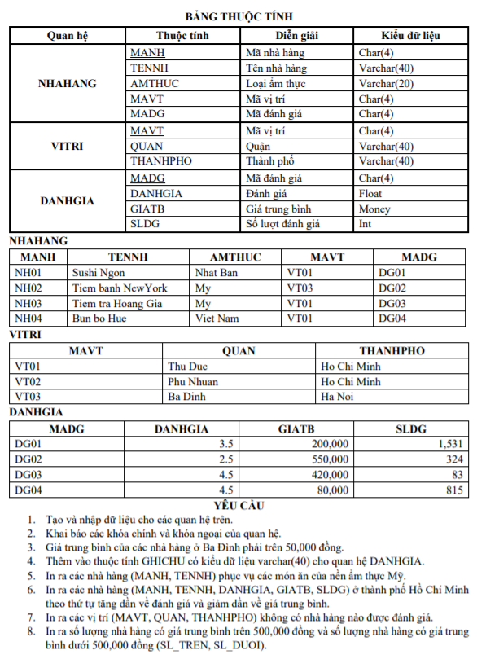

**Cho cơ sở dữ liệu sau:**

📌NHAHANG(<u>MANH</u>, TENNH, AMTHUC, MAVT, MADG)
Thông tin nhà hàng gồm: Mã nhà hàng, Tên nhà hàng, Loại ẩm thực, Mã vị trí, Mã đánh giá

📌VITRI(<u>MAVT</u>, QUAN, THANHPHO)
Thông tin vị trí bao gồm: Mã vị trí, Quận, Thành phố

📌DANHGIA(<u>MADG</u>, DANHGIA, GIATB, SLDG)
Thông tin đánh giá bao gồm: Mã đánh giá, Đánh giá, Giá trung bình, Số lượt đánh giá

**Viết câu lệnh SQL:**
1. Tạo và nhập dữ liệu cho các quan hệ trên.
2. Khai báo các khóa chính và khóa ngoại của quan hệ
3. Giá trung bình của các nhà hàng ở Ba Đình phải trên 50000 đồng
4. Thêm vào thuộc tính GHICHU có kiểu dữ liệu varchar(40) cho quan hệ DANHGIA
5. In ra các nhà hàng (MANH, TENNH) phục vụ các món ăn của nền ẩm thực Mỹ
6. In ra các nhà hàng (MANH, TENNH, DANHGIA, GIATB, SLDG) ở thành phố Hồ Chí Minh theo thứ tự tăng dần về đánh giá và giảm dần về giá trung bình
7. In ra các vị trí (MAVT, QUAN, THANHPHO) không có nhà hàng nào được đánh giá
8. In ra số lượng nhà hàng có giá trung bình trên 500000 đông và số lượng nhà hàng có giá trung bình dưới 500000 đồng (SL_TREN, SL_DUOI)

**Bảng câu hỏi đầy đủ**

